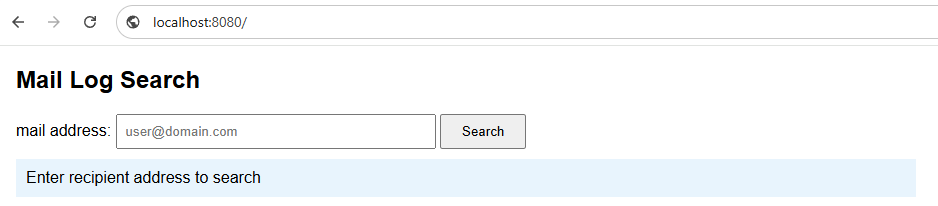
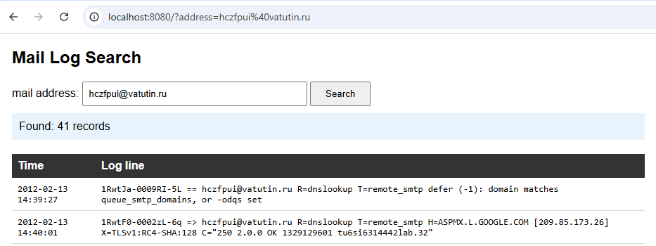
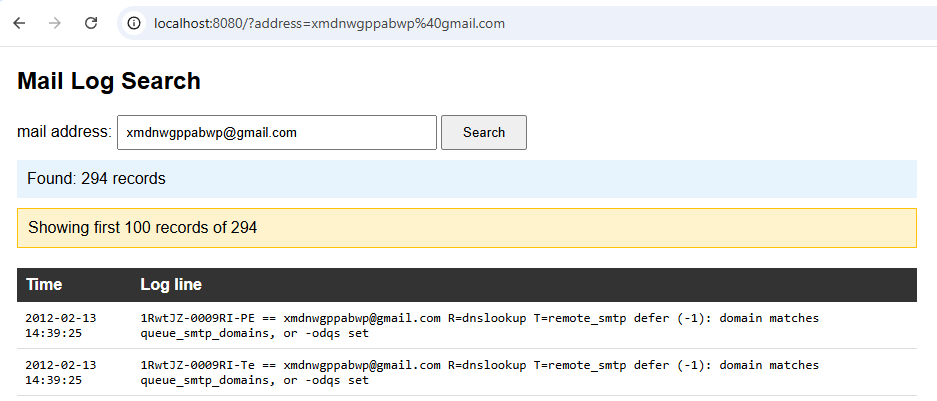

# Mail Log Search
Проект для парсинга логов почтового сервера, сохранения данных в PostgreSQL и веб-интерфейса для поиска записей

## Файлы проекта /project_files
1. out - файл лога 
2. pars.pl - парсер (#1 задание)
3. server.pl - создание html странички поиска данных по почте получателя (#2 задание)

## Запуск 
Проект был разработан на ОС Windows 10 Pro 22H2 
1. Установка Strawberry Perl
   - strawberry-perl-5.42.2.1-64bit.msi
2. Установка PostgreSQL + pgAdmin 4
   - postgresql-18.4-2-windows-x64.exe
3. Установка библиотек
   - DBI: 1.645
   - DBD::Pg: 3.8.0
   - HTTP::Daemon: 6.16
   - HTTP::Status: 7.01
4. Создание базы данных test_db, таблиц message и log (pgAdmin)
7. Запуск pars.pl
8. Запуск server.pl

---
---

---
---

---
---

---
---
